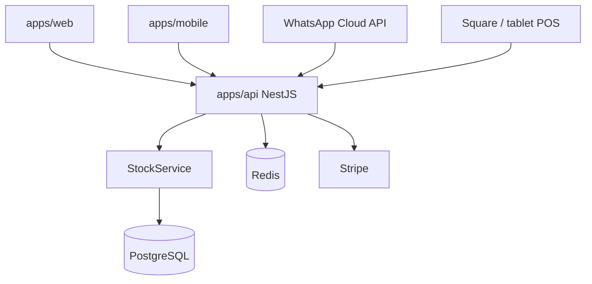

# System overview

```mermaid
flowchart TB
  Web[apps/web]
  Mobile[apps/mobile]
  WA[WhatsApp Cloud API]
  POS[Square / tablet POS]
  API[apps/api NestJS]
  Stock[StockService]
  PG[(PostgreSQL)]
  Redis[(Redis)]
  Stripe[Stripe]
  Web --> API
  Mobile --> API
  WA --> API
  POS --> API
  API --> Stock
  Stock --> PG
  API --> Redis
  API --> Stripe
```

Modular monolith. REST `/api/v1`. Admin is part of the same Next.js app at `/admin`.
