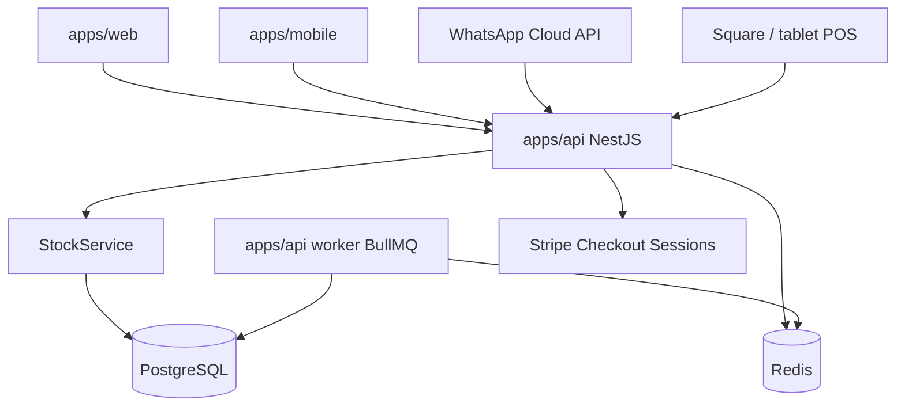

# System overview

Modular monolith. REST `/api/v1`. Admin is part of the same Next.js app at `/admin`.

Redis is the BullMQ backing store for background jobs (stale cart expiry, low-stock scan), not an application cache. Run the worker with `pnpm dev:worker` (or `pnpm --filter @motive-fashion/api start:worker` in production). The HTTP API process does not run those jobs.

Postgres is the source of truth for catalog, carts, orders, and inventory. Every sales channel goes through `StockService`.
