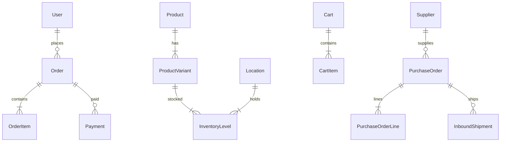

# ERD (core)

```mermaid
erDiagram
  User ||--o{ Order : places
  Product ||--|{ ProductVariant : has
  ProductVariant ||--|{ InventoryLevel : stocked
  Location ||--|{ InventoryLevel : holds
  Cart ||--|{ CartItem : contains
  Order ||--|{ OrderItem : contains
  Order ||--o{ Payment : paid
  Supplier ||--o{ PurchaseOrder : supplies
  PurchaseOrder ||--|{ PurchaseOrderLine : lines
  PurchaseOrder ||--o{ InboundShipment : ships
```

Money is integer cents (EUR). VAT stored per order and line.

Full Prisma schema: `apps/api/prisma/schema.prisma`.
